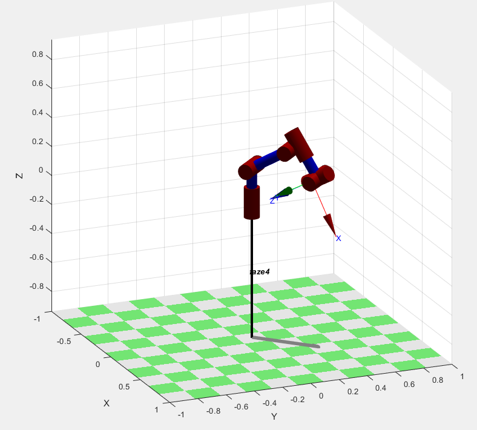
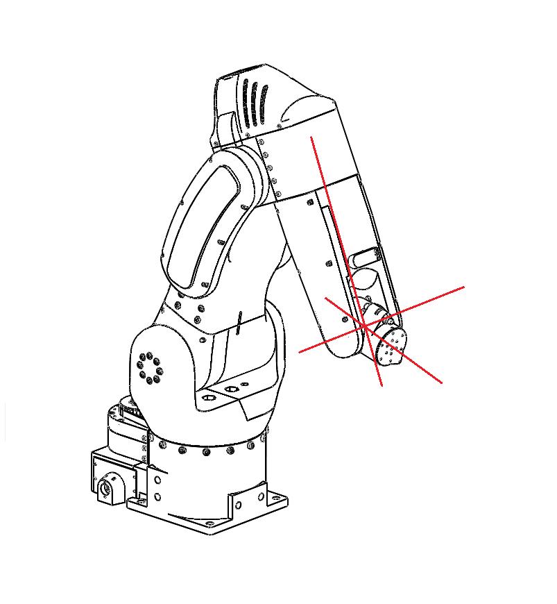
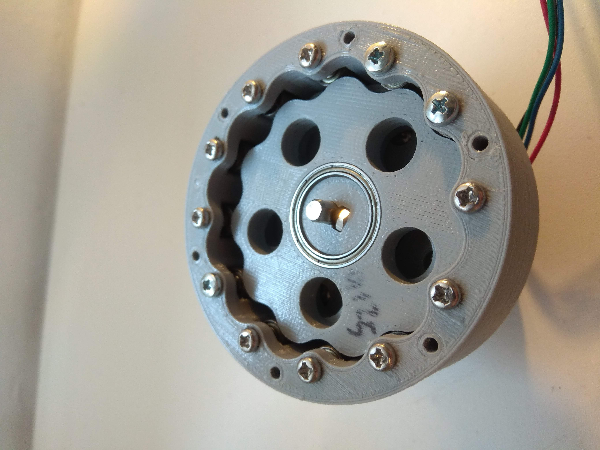

Design decisions
===========================

.. meta::
   :description lang=en: Design decisons that were made when designing faze4 arm.

Number of axis
--------------

I went with 6 axis because with 6+ axis we can reach same dot in space with different orientations.
Both pictures show arm at position x=0.3m , y=0.3m and z=0.2m but as you can see orientations are different. 

.. figure:: ../docs/images/30&180&90.png
    :figwidth: 400px
    :target: ../docs/images/30&180&90.png

Spherical wrist
---------------

This arm uses so called spherical wrist. Spherical wrist is configuration of joints where axes of rotation for joints 4,5,6 intersect.
You can see that in picture below. It is complicated mechanical system that in turn simplifies solving inverse kinematics for robot arm. You will see this configuration in a lot industrial robot arm. 

    
All wires are routed thru the middle of the arm and cant be seen.

Cycloidal reducer
-----------------

Why cycloidal reducers?

* They are really easy to 3d print
* can have large reduction ratio
* cheap
* low backlash even when 3d printed

.. note::
   When 3d printing them there are few things to keep in mind but that is discussed in sections troubleshooting and printing.

Motor position
--------------

Firstly i wanted to move all motors to the base of the arm to reduce weight each motor should carry. First idea was to just copy the design of this(link) kuka arm. I decided against that design and just went with probably most basic design where every motor is directly on the joint of actuation ( Except for joint 5 that i moved a little bit away).This is not good idea actually and if I was redesigning this arm I would try to move at least joint 3 to the bottom of the arm, but what is done is done.

.. figure:: ../docs/images/joints.png
    :figwidth: 400px
    :target: ../docs/images/joints.png

Joints 1,4 and 5 use belts in addition to cycloidal reducers. Belts are mostly used to offset the place where joint will be rotating so that we can route wires thru the body of robot. They also give some additional reduction ratio. For example Joint 1 has 15:1 cyclo but with belt our reduction ratio jumps to 25:1.

Reduction ratios:
-----------------

* Joint 1 -> 15:1 cycloidal reducer and 5:3 belt reduction = combined resulting in 25:1 reduction
* Joint 2 -> 27:1 cycloidal reducer
* Joint 3 -> 15:1 cycloidal reducer
* Joint 4 -> 11:1 cycloidal reducer and 28:26 belt reduction = combined resulting in 11.846153:1 reduction 
* Joint 5 -> 11:1 cycloidal reducer and 1:1 belt reduction = combined resulting in 11:1 reduction
* Joint 6 -> 19.19:1 planetary reducer

Belts
-----------------

* Joint 1 belt is HTD 5M 490 mm timing belt 10 mm wide and needs to be tightened with bearings
* Joint 4 belt is HTD 5M 430 mm timing belt 10 mm wide does not need to be tightened
* Joint 5 belt is HTD 5M 285 mm timing belt 10 mm wide and needs to be tightened with bearings

