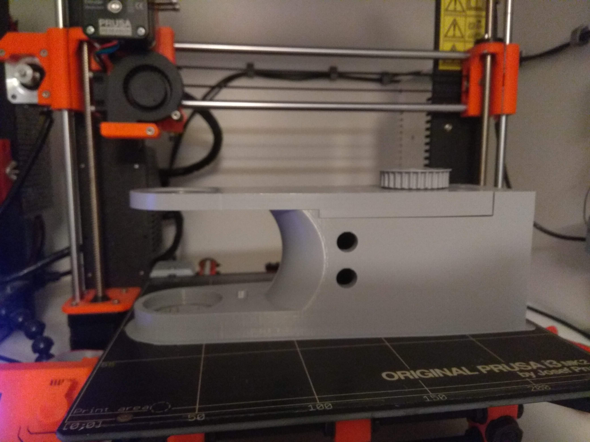

Printing
===========================

.. meta::
   :description lang=en: Printing tips.

Filament
------------

I recommend PETG since it can withstand larger temperatures then PLA and is easier to print then ABS. Since motors can heat up i think it is best choice.

Printer
------------

All parts are designed to be printed on Prusa MK2S, so if you have printer with build volume of 250x210x200 you are good to go.

Print settings and tips
------------------------

I printed all smaller parts with 0.15 layer height and all larger with 0.35 layer height.For infill try to stay in 25%-30% range. I used 3 outer perimeters and 7 top and 5 bottom layers.

.. Tip::

   When printing larger parts like: x x x , try to print at slower speeds and with small accelerations.Since those parts are really        large and heavy they tend to cause missing steps when reaching the end of 3d print due the inertia.
