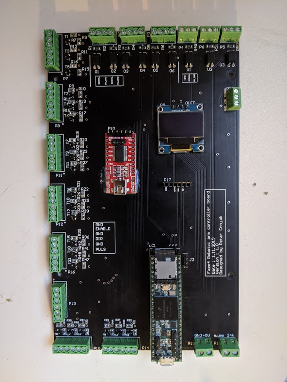
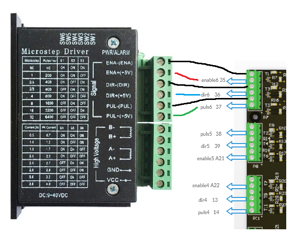
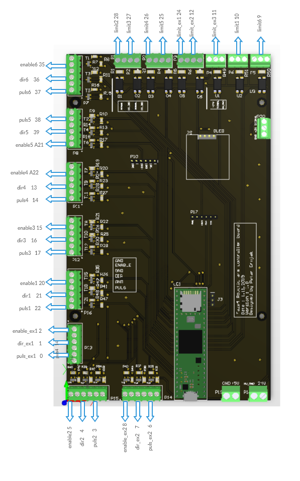

Electronics, PCB and wiring
===========================

.. meta::
   :description lang=en: info about Electronics and PCB.
   
All electronics can also be bought from ebay and similar sites. I used cheap stepper drivers from ebay but you can buy any stepper driver that can supply enough current for the steppers.

Check how i wired my arm in this file: FAZE4 Robotic arm electronics setup.pdf on github page:
https://github.com/PCrnjak/Faze4-Robotic-arm

.. Tip::

   From experience i found out that cheaper stepper drivers tend to make more noise, so if you want quiet robot arm buy more expensive drivers. I found ones from stepperonline good.

PCB V1
------------
This PCB is first version and has some errors that will be fixed in revision 2.
Board was created in Altium Circuitmaker and all files can be found here:

.. Warning::

  I recommend waiting for next version since this one has alot of errors.

* `All files for PCB`_

.. _All files for PCB: https://github.com/PCrnjak/Faze4-Robotic-arm/blob/master/Distribution_PCB.zip

Upper section of PCB are Inputs for limit switches and inductive sensors. All inputs on top are isolated with optocouplers. I did that since all wires of the arm are going thru same spot, that means "high voltage" stepper wires were near low voltage limit switch wires. That caused problems where steppers induced enough voltage on limit switch wires to trigger interrupts on teensy. That is why limit switches and sensors are connected to 24v.

left side is for stepper outputs. There are also 2 stepper outputs on bottom right side.

Bottom right side has 5V input and 24V input. You need both for arm to work. In the middle we have few extra serial ports and OLED display.

When wiring stepper drivers to the PCB i used TB6600  driver pinout as reference.I planned for all drivers to be connected like picture below. HIGH signal on ENABLE + pin would enable stepper drivers. Now i made some mistakes and not all drivers can be connected like that.

    
Now i made some mistakes and not all drivers can be connected like that. In picture below you can see how to connect all drivers. As you can see for joint 5 (connector below top one) i switched enable and puls pins. That means that puls5 pin ( pin 38 on teensy) is connected to puls pin on stepper driver. I also skipped Port that has no 5V level shifter since it didnt work well.

After wiring all dir,puls and enable pins you are left with power pins on stepper driver and A- A+ B- B+ Pins. Those are quite straightforward. 
Pins that have ext in name are extra pins that are now used in my version of arm.
