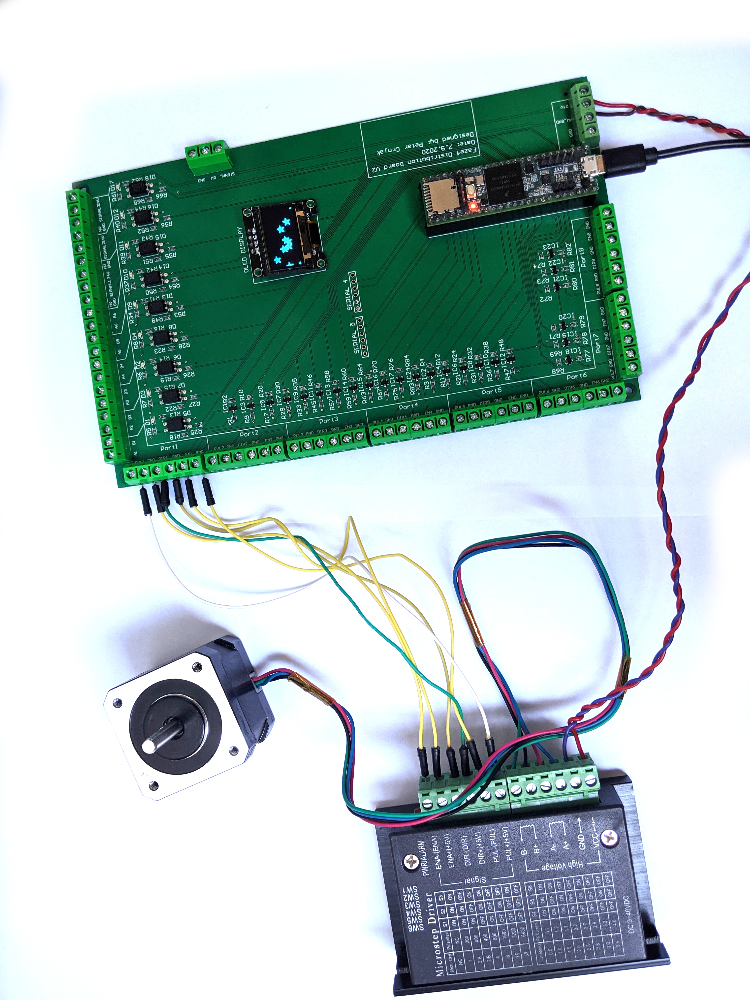
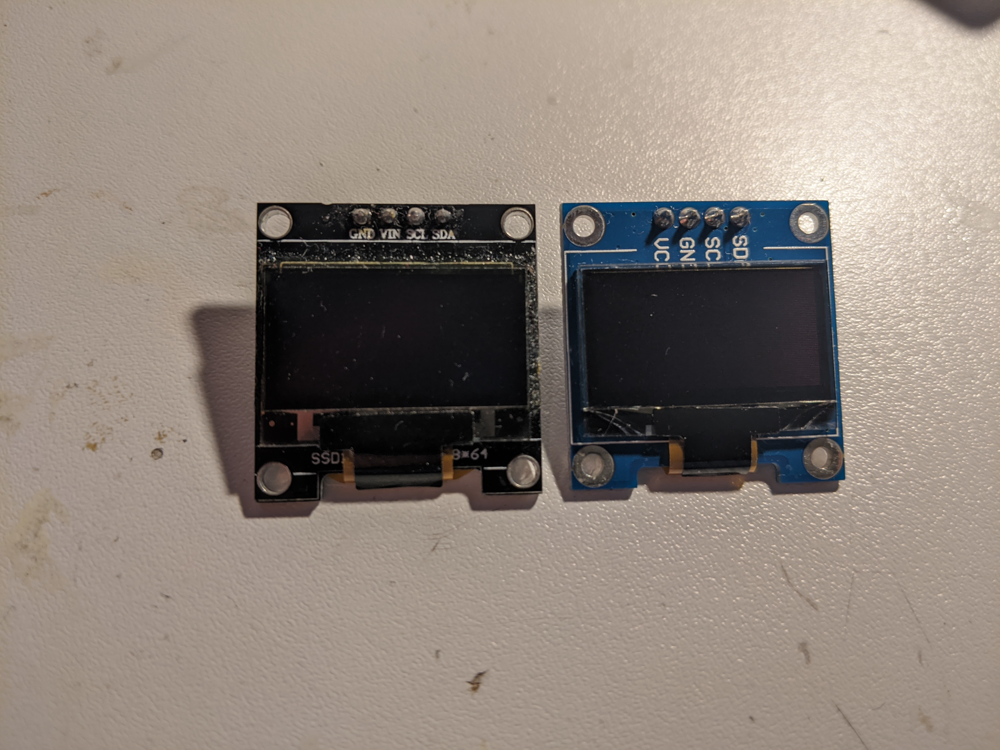
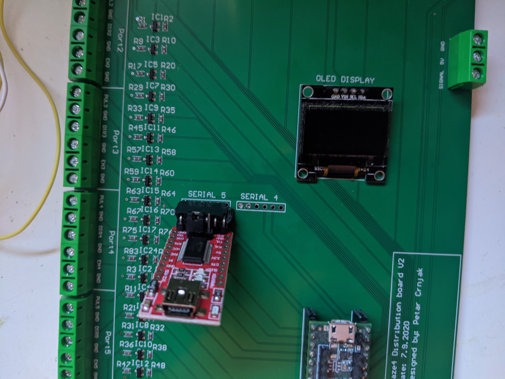
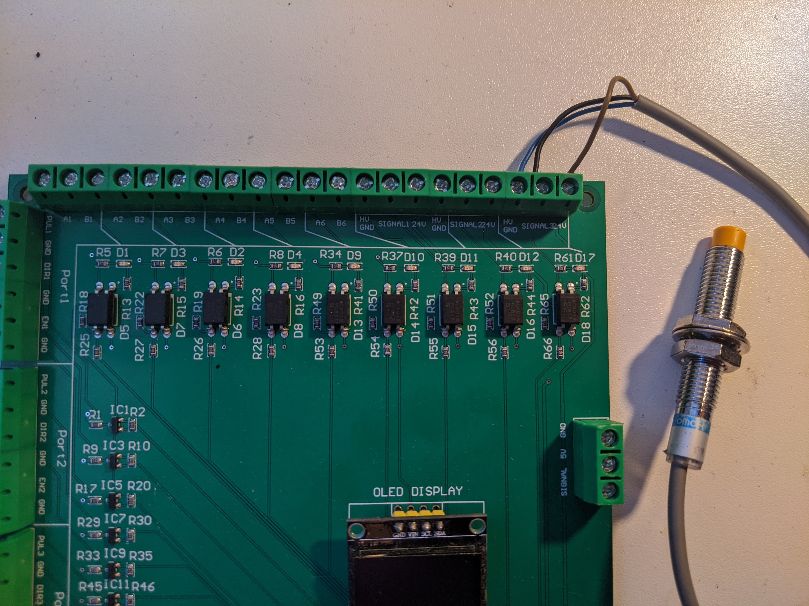

Electronics, PCB and wiring
===========================

.. meta::
   :description lang=en: info about Electronics and PCB.
   
All electronics can also be bought from eBay and similar sites. I used cheap stepper drivers from eBay but you can buy any stepper driver that can supply enough current for the steppers.

Check how i wired my arm in this file: FAZE4 Robotic arm electronics setup.pdf on github page:
https://github.com/PCrnjak/Faze4-Robotic-arm  (These instructions are for V1 version of board that is not recommended)

.. Tip::
   
   From experience, i found out that cheaper stepper drivers tend to make more noise, so if you want a quiet robot arm buy more expensive drivers. I foung ones from stepper online to be good.

Faze4 distribution PCB V2
---------------------------

.. warning::
   
   To use code seen in videos and in github repo you will need to modify some pin definitions!

.. figure:: ../docs/images/slika1.jpg
    :figwidth: 700px
    :target: ../docs/images/slika1.jpg

* `Schematic`_
.. _Schematic: https://github.com/PCrnjak/Faze4-Robotic-arm/blob/master/Faze4_DIST_board_v2_files/Schematic.PDF

* `Board STEP files`_
.. _Board STEP files: https://github.com/PCrnjak/Faze4-Robotic-arm/blob/master/Faze4_DIST_board_v2_files/Faze4_dist_v2_STEP.step

* `Board dimensions`_
.. _Board dimensions: https://github.com/PCrnjak/Faze4-Robotic-arm/blob/master/Faze4_DIST_board_v2_files/Board_dimensions.PDF

* `Test Codes`_
.. _Test Codes: https://github.com/PCrnjak/Faze4-Robotic-arm/tree/master/FAZE4_distribution_board_test_codes

Faze4 Distribution board V2 allows you to connect stepper drivers, limit switches, sensors, displays, microcontrollers, computers, and more with each other with clean and simple wiring. It is designed for Faze4 robotic arm but you can use it for any project from CNCs, 3D printers to use in the industrial assembly line.

It is designed to use the TEENSY 3.5 microcontroller but in near future, it will support boards like with STM32 microcontrollers and Atmegas.
Read more about Teensy here: https://www.pjrc.com/store/teensy35.html

Board outputs have level shifters that boost 3v3 from the microcontroller to 5V. That allows you to use a larger set of stepper drivers since they are usually designed for 5v logic.
5v is also much better for relays. 

Inputs for the board support limit switches and 24V sensors (like inductive, capacitive...) used in the industry. Inputs are also isolated with optocouplers from a microcontroller and use current signals that ensure no voltage induction in wires can accidentally trigger on microcontroller inputs that can cause errors and damage in real life. Inputs also have LED indicators that tell you when the signal is present.

Board also has 2 UART ports routed that can extend its communication abilities. 

It also supports typical 128x64 OLED displays.

When buying OLED display note the location of vcc and gnd pins.

* Order of pins should be: GND, vcc, SCL, SDA

* Check image below (LEFT ONE IS GOOD, RIGHT ONE IS BAD)

When connecting FTDI USB TTL Serial Adapter Module to PCB connect it like this. Board supports 2 modules operating at the same time!

    
    
Board use guide
----------------

Connect your teensy 3.5 to board. Once connected it uses onboard 5v regulator on teensy to level shift all 3v3 signals to 5v. If you see problems with stability of signals connect external 5V power source to the connector on the bottom right corner. 

To use inputs on top of the board you NEED 24V power source. Once you connect 24V power to the bottom right connetor you can connect limit switches to the ports labled with (A1 B1, A2 B2, A3 B3 ...) When connecting limit switches connect one end of limit switch to the A1 and other end to B1. There are total of 6 ports for limit switch inputs.

Ports labeled with HV_GND, SIGNAL, 24V are used by Industrial sensor that output 24V signal. One example is inductive sensor.

There is one port on the right side and it is used for grippers. It outputs 3v3 signal.

PCB V1 (old, not recommended)
------------------------------
This PCB is first version and has some errors that will be fixed in revision 2.
Board was created in Altium Circuitmaker and all files can be found here:

.. Warning::

  I recommend waiting for next version since this one has alot of errors.

* `All files for PCB`_

.. _All files for PCB: https://github.com/PCrnjak/Faze4-Robotic-arm/blob/master/Distribution_PCB.zip

.. figure:: ../docs/images/plocica_v1.jpg
    :figwidth: 400px
    :target: ../docs/images/plocica_v1.jpg

Upper section of PCB are Inputs for limit switches and inductive sensors. All inputs on top are isolated with optocouplers. I did that since all wires of the arm are going thru same spot, that means "high voltage" stepper wires were near low voltage limit switch wires. That caused problems where steppers induced enough voltage on limit switch wires to trigger interrupts on teensy. That is why limit switches and sensors are connected to 24v.

left side is for stepper outputs. There are also 2 stepper outputs on bottom right side.

Bottom right side has 5V input and 24V input. You need both for arm to work. In the middle we have few extra serial ports and OLED display.

When wiring stepper drivers to the PCB i used TB6600  driver pinout as reference.I planned for all drivers to be connected like picture below. HIGH signal on ENABLE + pin would enable stepper drivers. Now i made some mistakes and not all drivers can be connected like that.

.. figure:: ../docs/images/stepper_connection.png
    :figwidth: 500px
    :target: ../docs/images/stepper_connection.png
    
Now i made some mistakes and not all drivers can be connected like that. In picture below you can see how to connect all drivers. As you can see for joint 5 (connector below top one) i switched enable and puls pins. That means that puls5 pin ( pin 38 on teensy) is connected to puls pin on stepper driver. I also skipped Port that has no 5V level shifter since it didnt work well.

.. figure:: ../docs/images/sim_plocica_with_labels.png
    :figwidth: 500px
    :target: ../docs/images/sim_plocica_with_labels.png

After wiring all dir,puls and enable pins you are left with power pins on stepper driver and A- A+ B- B+ Pins. Those are quite straightforward. 
Pins that have ext in name are extra pins that are now used in my version of arm.
