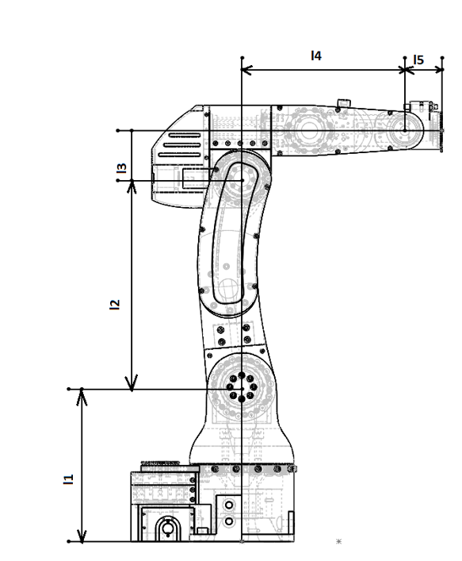

Robot data
===========================

.. meta::
   :description lang=en: General info about Faze4 robotic arm.

Dimensions
-----------

* L1 =  0.23682m
* L2 =  0.32m
* L3 = 0.0735m
* L4 = 0.2507m
* L5 = 0.057m

    
    

Reduction ratios:
-----------------

* Joint 1 -> 15:1 cycloidal reducer and 5:3 belt reduction = combined resulting in 25:1 reduction
* Joint 2 -> 27:1 cycloidal reducer
* Joint 3 -> 15:1 cycloidal reducer
* Joint 4 -> 11:1 cycloidal reducer and 28:26 belt reduction = combined resulting in 11.846153:1 reduction 
* Joint 5 -> 11:1 cycloidal reducer and 1:1 belt reduction = combined resulting in 11:1 reduction
* Joint 6 -> 19.19:1 planetary reducer

Belts
-----------------

* Joint 1 belt is HTD 5M 490 mm timing belt 10 mm wide and needs to be tightened with bearings
* Joint 4 belt is HTD 5M 430 mm timing belt 10 mm wide does not need to be tightened
* Joint 5 belt is HTD 5M 285 mm timing belt 10 mm wide and needs to be tightened with bearings

